# Architecture & Design Diagrams
## SBI Card AI-BOT Outbound Voice Agent

| | |
|---|---|
| **Document** | DIAG-VOICE-001 |
| **Version** | 0.1 |
| **Date** | 15 September 2026 |

All diagrams are Mermaid source, versioned with the code. No binary images — they rot, they cannot
be diffed, and nobody can tell which one is current.

**Contents**
1. [System context (C4 L1)](#1-system-context--c4-level-1)
2. [Container view (C4 L2)](#2-container-view--c4-level-2)
3. [Component view (C4 L3)](#3-component-view--voice-agent-internals)
4. [Sequence — one conversational turn](#4-sequence--one-conversational-turn)
5. [Sequence — FlexiPay happy path](#5-sequence--flexipay-happy-path)
6. [Sequence — disqualification](#6-sequence--disqualification-the-common-case)
7. [Sequence — warm transfer](#7-sequence--warm-transfer-with-whisper-and-screen-pop)
8. [Sequence — safe exit](#8-sequence--safe-exit)
9. [Dialog state machine](#9-dialog-state-machine)
10. [Entity-relationship model](#10-entity-relationship-model)
11. [Campaign data pipeline](#11-campaign-data-pipeline)
12. [Deployment view](#12-deployment-view)
13. [Per-product flow variance](#13-per-product-flow-variance)

---

## 1. System context — C4 Level 1

Who talks to what. Only the blue box is ours.

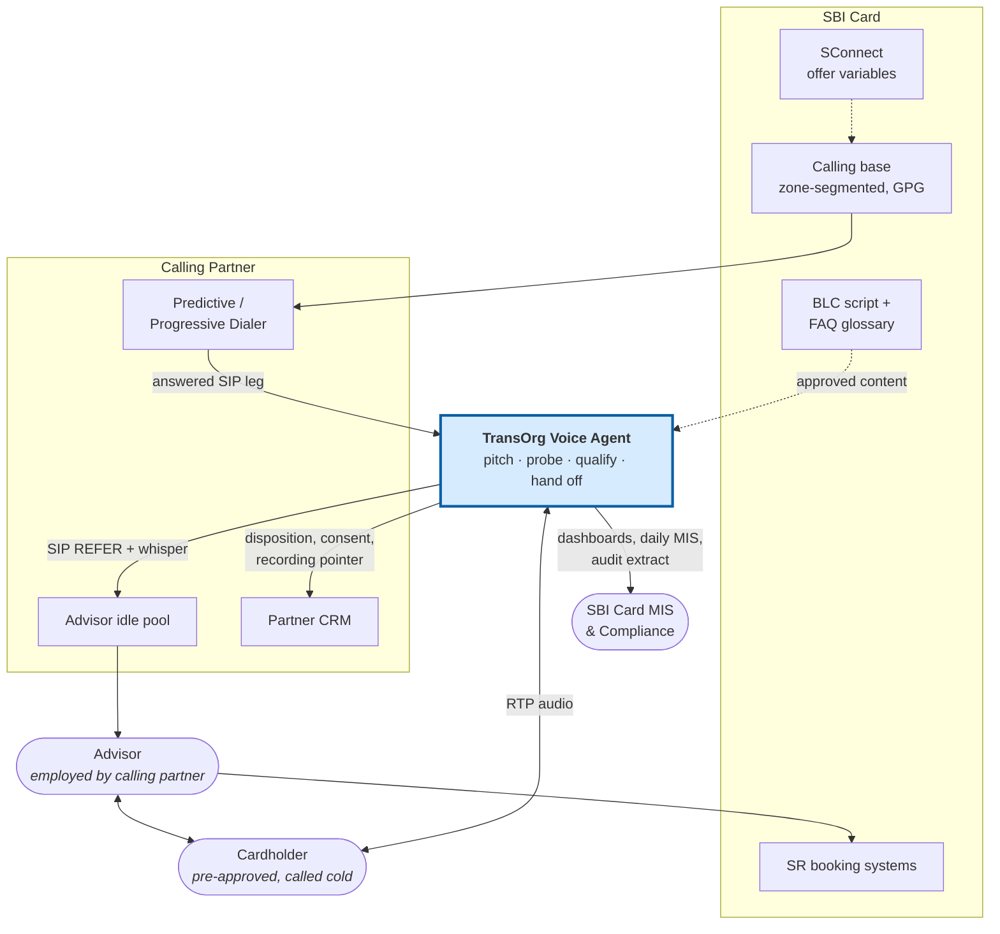

---

## 2. Container view — C4 Level 2

What runs inside our boundary.

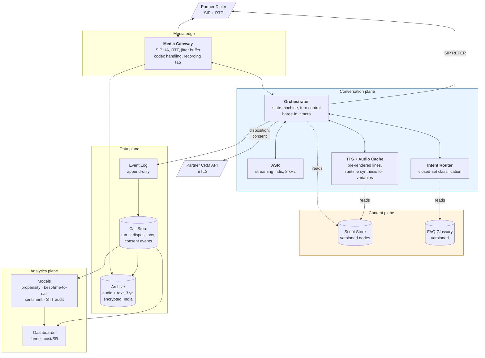

**Why the content plane is separate.** BLC-approved script and glossary content changes on a
compliance cadence, not an engineering one. NFR-401 requires a script change to deploy without a
code release. Anything else means a legal edit waits on a sprint.

---

## 3. Component view — Voice Agent internals

The turn loop, in detail.

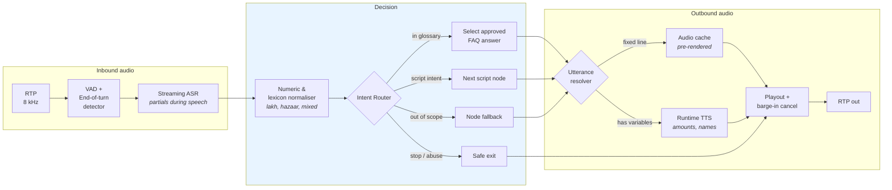

> **The single most important property of this diagram:** the LLM sits in `Intent Router` — it
> *chooses*. It is absent from the output path entirely. Every utterance resolves to approved
> content. That is what makes FR-203 verifiable from logs alone.

---

## 4. Sequence — one conversational turn

The latency-critical path. Budget in `docs/DESIGN.md`.

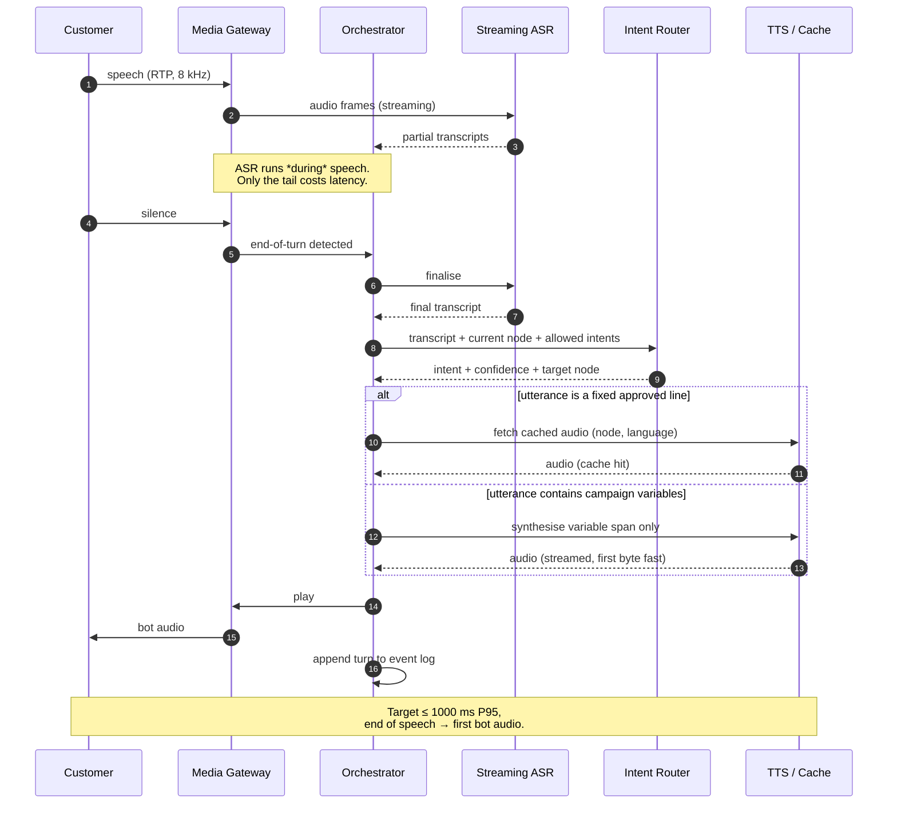

---

## 5. Sequence — FlexiPay happy path

Per `CH-S9`. The advisor runs the IVR; the bot never touches it.

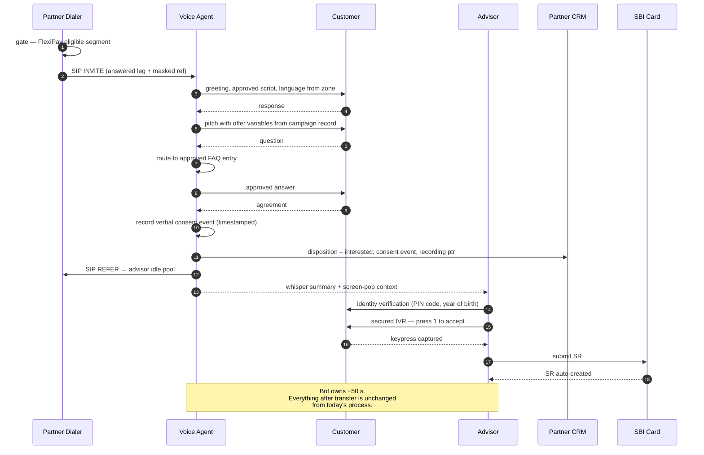

---

## 6. Sequence — disqualification, the common case

~88% of contacts. This path is where all the savings are, so it is the one to optimise.

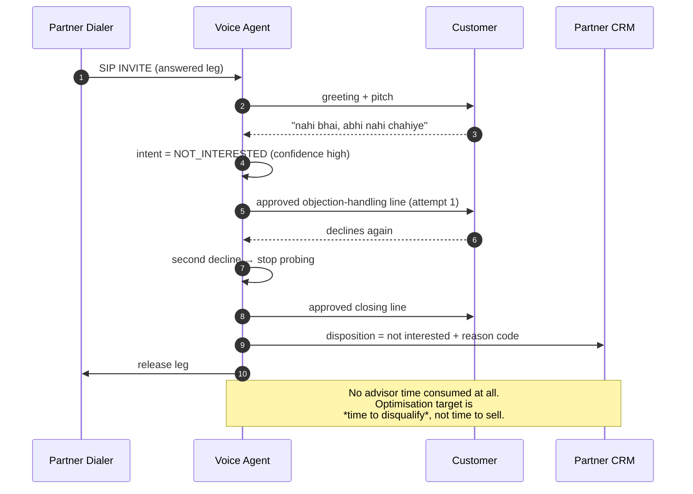

---

## 7. Sequence — warm transfer with whisper and screen-pop

Get this wrong and the advisor re-asks everything, destroying the time the bot saved (R-13).

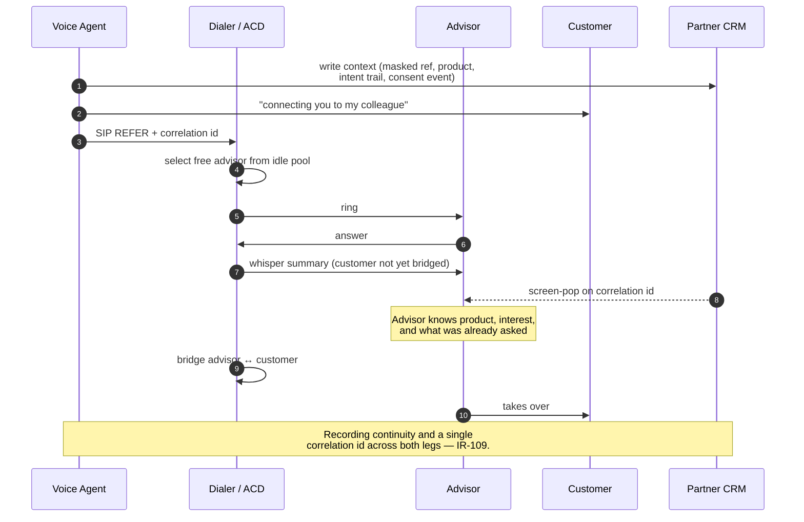

---

## 8. Sequence — safe exit

Non-negotiable. Any turn, any state.

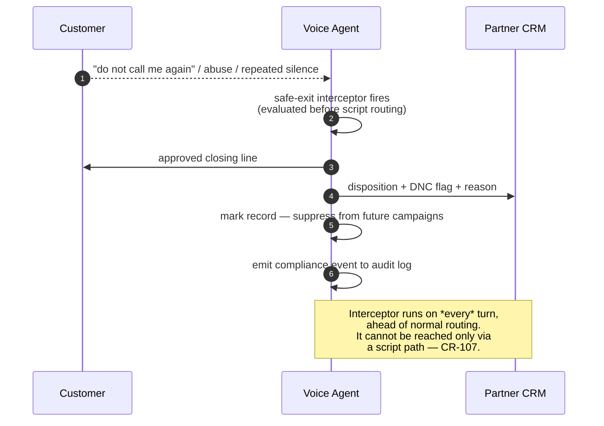

---

## 9. Dialog state machine

FR-201. The script is a state machine; the model chooses transitions, never content.

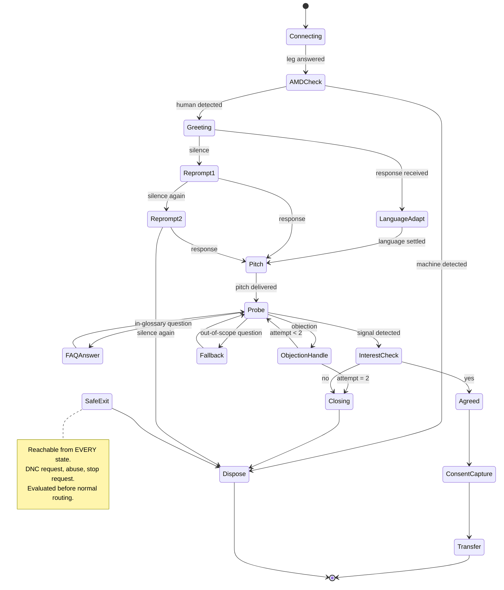

**Every node carries:** approved utterance (per language) · permitted intents and their targets ·
prohibited content · fallback utterance · timeout and re-prompt. Nothing else is permitted at a node.

---

## 10. Entity-relationship model

DR-101 to DR-106. Note what is absent: there is no customer entity, no name, no card number.
`masked_ref_id` is the only customer key we ever hold (CR-101).

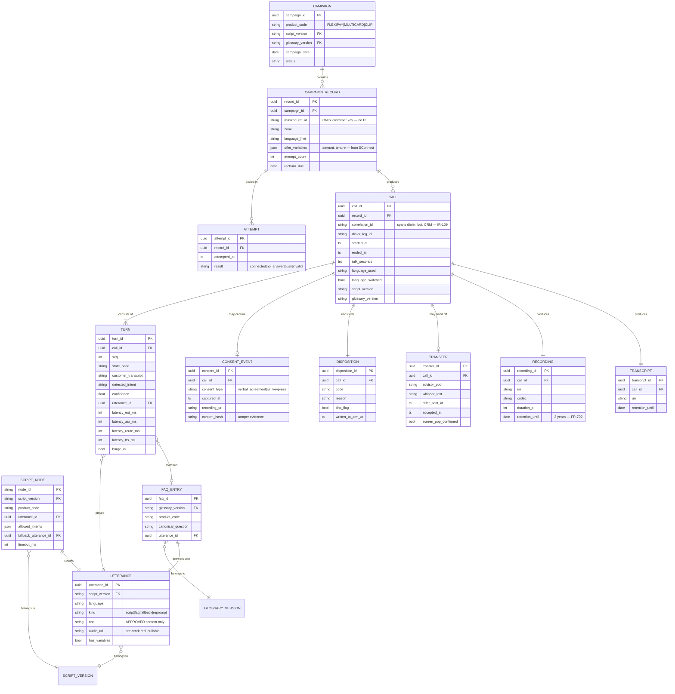

**Design notes.**
- `script_version` and `glossary_version` are stamped on `CALL`, not looked up live. A call must be
  reconstructable years later against the exact content that was approved at the time (FR-204).
- `TURN` stores per-stage latency so NFR-101 is measurable from data, not from a load test.
- `CONSENT_EVENT.consent_type` is deliberately an enum with both values — it absorbs whichever way
  open item OI-1 resolves without a schema migration.
- `content_hash` makes consent artefacts tamper-evident (CR-102).

---

## 11. Campaign data pipeline

Steps 1–8 are SBI Card's existing, unchanged process. We join at step 9.

```mermaid
flowchart LR
    A["1 · Analytics/IT<br/>prepare base<br/><i>zone-segmented</i>"] --> B["2 · IMAC<br/>GPG encrypt<br/>WinSCP"]
    B --> C["3 · Vendor<br/>auto-decrypt<br/>per nomenclature"]
    C --> D["4 · Touchless<br/>dialer upload"]
    D --> E["5 · DNCR<br/>scrubbing"]
    E --> F["6 · MIS Ops<br/>receives<br/><i>PII stripped</i>"]
    F --> G["7 · Campaign<br/>file prep"]
    G --> H["8 · Dial<br/>predictive /<br/>progressive"]
    H --> I["<b>9 · BOT</b><br/>pitch · probe ·<br/>qualify"]
    I --> J["10 · Advisor<br/>verify · consent ·<br/>SR"]

    style A fill:#eee
    style B fill:#eee
    style C fill:#eee
    style D fill:#eee
    style E fill:#eee
    style F fill:#eee
    style G fill:#eee
    style H fill:#eee
    style I fill:#d7ebff,stroke:#0b5fa5,stroke-width:3px
    style J fill:#ffe9d6
```

---

## 12. Deployment view

India region only (CR-105). Autoscaled to the calling window, not 24×7 (NFR-204).

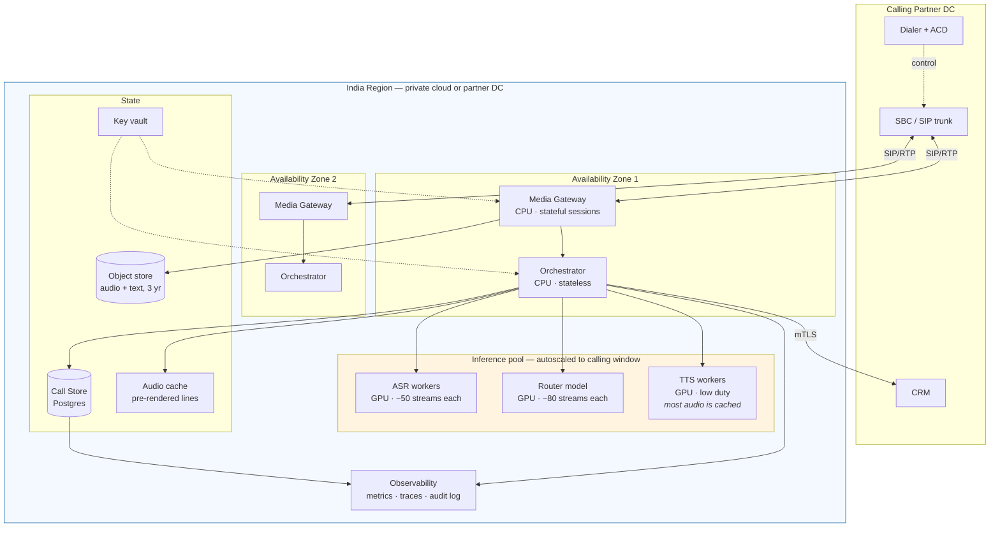

**Scaling notes.** Media gateways are stateful and scale with concurrent legs (~250 peak, headroom
to 500 — NFR-201). Orchestrators are stateless and scale horizontally. GPU pools scale on queue
depth and idle outside the calling window — this is worth roughly 3× on inference cost versus
running continuously. See `cost_model.py`.

---

## 13. Per-product flow variance

The bot's job is near-identical across products. What differs is everything after the yes.

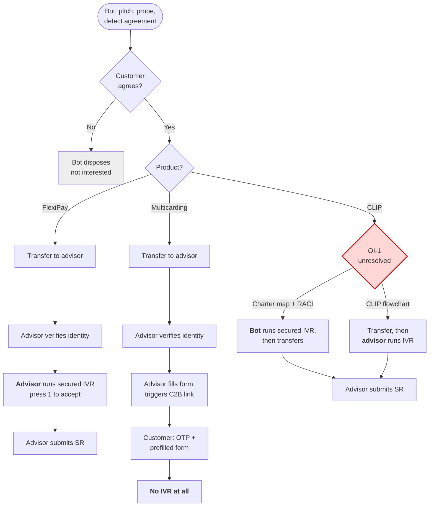

> The red node is [OI-1](SRS.md#10-open-items). It changes CLIP call duration, our position in the
> regulated consent chain, and per-product pricing. Do not design past it — design *around* it, via
> `CONSENT_EVENT.consent_type`.

---

## Rendering

GitHub, GitLab and most Markdown viewers render Mermaid natively. For a local check:

```bash
npx -y @mermaid-js/mermaid-cli -i docs/DIAGRAMS.md -o /tmp/diagrams.md
```
