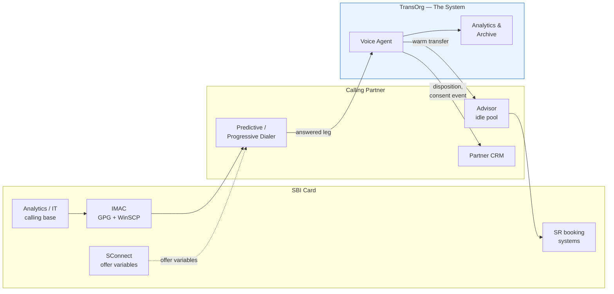

# Software Requirements Specification
## SBI Card AI-BOT Outbound Telesales Voice Agent

| | |
|---|---|
| **Document** | SRS-VOICE-001 |
| **Version** | 0.1 — Draft for internal review |
| **Date** | 15 September 2026 |
| **Owner** | TransOrg Analytics |
| **Status** | Draft. Not for client circulation. |
| **Standard** | Structured per ISO/IEC/IEEE 29148:2018 |

---

## 1. Introduction

### 1.1 Purpose

This document specifies the requirements for an AI voice agent that automates the front portion
of SBI Card's outbound cross-sell calls. It is written for two audiences: the TransOrg engineering
team who will build it, and SBI Card's technology and InfoSec reviewers who must approve it.

Every requirement carries a source citation. Requirements originating from SBI Card's own
documents are the contract. Requirements marked `[TransOrg]` are our engineering judgement and
are negotiable.

### 1.2 Scope

**In scope.** A voice agent that answers an outbound call leg handed to it by the calling
partner's dialer, conducts a scripted sales conversation in one of eight or nine Indian
languages, answers questions from an approved FAQ glossary, determines customer interest,
warm-transfers interested customers to a human advisor with context, disposes uninterested
calls, and records everything for audit. Plus the six analytics and MLOps capabilities SBI Card
lists alongside the voice agent.

**Explicitly out of scope.** The dialer. The SIP trunk. The CRM. Identity verification. Booking.
Service Request creation. The campaign data pipeline (steps 1–8 of the existing process).
Customer PII of any kind.

**Phase 1 products.** FlexiPay, Multicarding, CLIP. Card upgrades, cash products and insurance
are named in the opportunity but excluded from Phase 1.

### 1.3 Source documents and citation keys

| Key | Document |
|---|---|
| `CH-S2` … `CH-S11` | *AI BOT Calling.pptx*, SBI Card project charter, slide number. Received 2 Sep 2026. |
| `CH-RACI` | Charter slide 7, RACI matrix |
| `EM-1` | Shrey Bhardwaj email, 27 Aug 2026 |
| `EM-2` | Shrey Bhardwaj email + charter attachment, 2 Sep 2026 |
| `CTX` | `Context.md`, TransOrg engagement brief |
| `[TransOrg]` | Originated by TransOrg. Not a client requirement. |

### 1.4 Conventions

- **Priority** uses MoSCoW: `M` Must, `S` Should, `C` Could, `W` Won't (this phase).
- **Verification** is one of: `T` Test, `D` Demonstration, `I` Inspection, `A` Analysis.
- "The System" means the TransOrg voice layer only — not the dialer, CRM or advisor desktop.
- Requirements are stated to be individually testable. If a requirement cannot be verified,
  it is a goal, not a requirement, and does not belong here.

---

## 2. Overall Description

### 2.1 Product perspective

The System is one component inside a call chain owned by three parties. It replaces the advisor
only for the pitch-and-probe segment of the conversation.

Only the blue zone is new. Steps 1–8 of SBI Card's existing data pipeline are unchanged
(`CH-S9`, `CH-S10`, `CH-S11` — the first eight boxes of all three flowcharts are identical
between current and proposed states).

### 2.2 Product functions — the seven capabilities

SBI Card's charter (`CH-S4`) titles its scope slide *"Project Scope: AI Voice Platform Features —
7 Key Components & Capabilities"*. Only the first is a voice bot. This matters: six of seven are
analytics and MLOps.

| # | Capability | Charter wording |
|---|---|---|
| 1 | Outbound AI voice agents | "Deploy specialized conversational agents tailored for CLIP, Multicarding, and Flexipay workflows" |
| 2 | Sentiment analysis | "Analyze outbound call interactions to extract customer sentiment, trends, and behavioral insights" |
| 3 | Best time to call analysis | "Optimize calling windows based on historical metadata to improve connect rates" |
| 4 | Intelligence cuts | "Provides visual data reporting and dashboards tracking conversion metrics and contact attempts" |
| 5 | Speech-to-text quality audit | "Evaluates transcription accuracy and manages a secure, 3-year storage archive of all call texts" |
| 6 | Successful bot call repository | "Archiving successful automated interactions for quality assurance, compliance, and training" |
| 7 | Languages covered | "Multi-lingual support across 8 languages" |

### 2.3 User classes

| Class | Who | Interaction with the System |
|---|---|---|
| Customer | SBI Card cardholder, pre-approved, called cold | Speaks to the bot. Never sees a UI. |
| Advisor | Employed by the calling partner | Receives warm transfers with a whisper summary and screen-pop context |
| Agency Operations | Calling partner | Monitors campaigns, reviews dispositions |
| MIS Operations | SBI Card | Consumes daily reporting and dashboards (`CH-S6` Key Deliverables) |
| Compliance / Audit | SBI Card BLC | Reviews consent recordings, script adherence, audit trail |
| TransOrg Ops | Us | Script configuration, monitoring, QA sampling, model tuning |

### 2.4 Operating environment

- Inbound media: SIP signalling and RTP audio at 8 kHz narrowband from the partner's dialer.
- Deployment: India region only. Private cloud or inside the calling partner's infrastructure.
- Calling window: business hours only, subject to TCCCPR. The charter says *"100% Availability
  during calling hours"* (`CH-S2`) — availability is bounded to the calling window, not 24×7.
- Concurrency: sized for Phase-1 coverage. See NFR-201.

### 2.5 Constraints

| ID | Constraint | Source |
|---|---|---|
| CON-1 | The System may only speak BLC-approved content. Generation of product terms is prohibited. | `CH-S3` step 3 |
| CON-2 | Answers to customer questions come from the SBI Card FAQ glossary database. | `CH-S3` step 4 |
| CON-3 | The calling base contains no PII. | `CH-S6` Compliance & Audit |
| CON-4 | Identity verification, booking and SR creation remain with the advisor. | `CH-RACI` |
| CON-5 | The System integrates with the partner's existing dialer and CRM. It does not replace them. | `CH-S6` System Integration |
| CON-6 | All call text retained for three years in secure storage. | `CH-S4` feature 5 |
| CON-7 | Data and inference must remain in India. | `[TransOrg]` — RBI/DPDP inference, to be confirmed at InfoSec review |

### 2.6 Assumptions and dependencies

| ID | Assumption | If wrong |
|---|---|---|
| ASM-1 | The FAQ glossary is a finite set of approved Q/A pairs supplied by SBI Card. | If open-ended Q&A is expected, the guardrail architecture changes fundamentally. |
| ASM-2 | The partner provides a SIP interface to route answered legs to us, at no media-streaming charge. | Adds ~₹0.15/min — more than our entire model cost. |
| ASM-3 | Offer variables (amount, tenure) arrive in the campaign file from SConnect. | We cannot generate them; the pitch becomes generic. |
| ASM-4 | The advisor captures the IVR consent keypress; the bot captures verbal agreement only. | If the bot runs the IVR, we enter the regulated consent chain. **Unresolved — see §10.** |
| ASM-5 | Language assignment can be derived from the base's existing zone segmentation. | Requires asking the customer, which costs time and conversion. |

---

## 3. External Interface Requirements

| ID | Requirement | Source | Pri | Ver |
|---|---|---|---|---|
| IR-101 | The System shall accept an inbound SIP INVITE from the partner dialer for each answered call leg, and negotiate RTP audio at 8 kHz. | `CH-S6` | M | T |
| IR-102 | The System shall accept campaign records containing a masked reference identifier, product code, language hint, and offer variables. It shall reject any record containing a field identified as PII. | `CH-S6`, CON-3 | M | T |
| IR-103 | The System shall transfer an interested customer to the partner advisor pool, preserving the media path and call identity for recording continuity. | `CH-S3` step 6 | M | T |
| IR-104 | The System shall deliver a whisper summary to the receiving advisor before the customer is connected. | `CTX` §3.4 `[TransOrg]` | S | D |
| IR-105 | The System shall write disposition, consent event, and a recording pointer to the partner CRM over a mutually authenticated TLS API. | `CH-S6` | M | T |
| IR-106 | The System shall expose the script and FAQ glossary as versioned configuration, loadable without code deployment. | `[TransOrg]` | M | I |
| IR-107 | The System shall expose dashboards covering conversion metrics and contact attempts. | `CH-S4` feature 4 | M | D |
| IR-108 | The System shall produce a daily MIS report and audit log extract. | `CH-S6` Key Deliverables | M | T |
| IR-109 | The System shall propagate a correlation identifier across dialer, bot, CRM and archive such that a single call can be reconstructed end to end. | `CH-S6` Compliance & Audit | M | T |

---

## 4. Functional Requirements

### 4.1 Call handling

| ID | Requirement | Source | Pri | Ver |
|---|---|---|---|---|
| FR-101 | The System shall answer each successful contact and begin the approved script for the product code on the campaign record. | `CH-S3` step 3 | M | T |
| FR-102 | The System shall distinguish a live human from an answering machine, and shall terminate and dispose calls answered by machine without playing the pitch. | `[TransOrg]` | S | T |
| FR-103 | The System shall support barge-in: when the customer begins speaking, playback shall stop within 200 ms. | `[TransOrg]` | M | T |
| FR-104 | The System shall detect end of customer turn and begin its response without requiring the customer to pause unnaturally. | `[TransOrg]` | M | T |
| FR-105 | On two consecutive silences after re-prompt, the System shall dispose the call and mark the record for re-churn. | `[TransOrg]` | M | T |
| FR-106 | The System shall terminate the call immediately on a do-not-call request, abuse, or an explicit request to stop, and shall flag the record. | `[TransOrg]`, TCCCPR | M | T |
| FR-107 | The System shall not treat Indic backchannels (*haan*, *hmm*, *achha*, *ji*, *theek hai*) as interruptions or as agreement. A maintained per-language continuer list shall gate the barge-in trigger. | `[TransOrg]` | M | T |
| FR-108 | The System shall distinguish acoustic echo of its own output from genuine customer speech, by comparing interruption onset against playback position. | `[TransOrg]` | M | T |
| FR-109 | The System shall disclose, in its opening turn, that the caller is an automated agent and on whose behalf it is calling. | TCCCPR; RBI FREE-AI Protection pillar | M | T |

### 4.2 Script execution

| ID | Requirement | Source | Pri | Ver |
|---|---|---|---|---|
| FR-201 | The System shall execute the BLC-approved script as a deterministic state machine. Each state defines its permitted utterances, permitted intents, transitions, and fallback. | `CH-S3` step 3 | M | I |
| FR-202 | The System shall render offer values (amount, tenure, product terms) from campaign variables only. It shall never generate a numeric offer term. | `CH-S9` step 9a, CON-1 | M | T |
| FR-203 | The System shall not emit any utterance that is not traceable to an approved script line, approved FAQ answer, or approved fallback. | CON-1, CON-2 | M | T |
| FR-204 | Script and glossary content shall be versioned, and every call record shall reference the exact content version used. | `[TransOrg]` | M | T |
| FR-205 | The System shall support per-product script variants for FlexiPay, Multicarding and CLIP. | `CH-S4` feature 1 | M | D |

### 4.3 FAQ and objection handling

| ID | Requirement | Source | Pri | Ver |
|---|---|---|---|---|
| FR-301 | The System shall probe customers and address queries using the FAQ glossary database supplied by SBI Card. | `CH-S3` step 4 | M | T |
| FR-302 | The System shall classify a customer utterance to at most one approved glossary entry, or to an out-of-scope outcome. | `[TransOrg]` | M | T |
| FR-303 | On an out-of-scope question, the System shall play the state's approved fallback and route toward a human. It shall not attempt an answer. | CON-2 | M | T |
| FR-304 | The System shall handle at least two objection exchanges before disposing a call as not interested. | `[TransOrg]` | S | T |

### 4.4 Interest detection, consent and handoff

| ID | Requirement | Source | Pri | Ver |
|---|---|---|---|---|
| FR-401 | The System shall determine whether the customer agrees to the offer and record that determination as a structured outcome. | `CH-S3` step 5 | M | T |
| FR-402 | On agreement, the System shall transfer the call to an advisor in the dialer idle pool. | `CH-S3` step 6 | M | T |
| FR-403 | On non-agreement, the System shall dispose the call with a reason code and release the line. | `CH-S9` step 9b, `CH-S12` | M | T |
| FR-404 | The System shall capture the customer's verbal agreement as a timestamped, recorded consent event. | `CH-RACI` Consent Capture = BOT Engine (R) | M | T |
| FR-405 | For CLIP, the System shall support conducting the secured IVR journey **if and only if** SBI Card confirms this scope. Until confirmed, the advisor conducts the IVR. | `CH-S3` step 5 vs `CH-S11` step 11b — **contradiction, see §10** | C | D |
| FR-406 | For Multicarding, the System shall not attempt an IVR journey. | `CH-S3` step 5, `CH-S10` | M | I |
| FR-407 | For FlexiPay, the secured IVR shall be conducted by the advisor after transfer. | `CH-S9` step 11a, `CH-S3` step 5 | M | I |

### 4.5 Language

| ID | Requirement | Source | Pri | Ver |
|---|---|---|---|---|
| FR-501 | The System shall support English, Hindi, Bengali, Marathi, Tamil, Telugu, Malayalam and Kannada. Gujarati is pending confirmation. | `CH-S4` feature 7 vs `EM-1` — **discrepancy, see §10** | M | T |
| FR-502 | The System shall select an initial language from the campaign record's zone segmentation without asking the customer. | `[TransOrg]` | M | T |
| FR-503 | The System shall detect a language mismatch from the customer's first utterance and switch, logging the switch as a quality metric. | `[TransOrg]` | S | T |
| FR-504 | The System shall correctly interpret code-mixed speech (Hinglish and equivalents) and spoken Indian numeric forms including *lakh*, *hazaar* and mixed numerals. | `[TransOrg]` | M | T |
| FR-505 | Speech quality metrics shall be reported **per language**, not aggregated. | `[TransOrg]` | M | I |

### 4.6 Retry and attempt policy

| ID | Requirement | Source | Pri | Ver |
|---|---|---|---|---|
| FR-601 | The System shall record every contact attempt against the masked reference identifier and expose attempt counts. | `CH-S6` Process Flow step 5 "Retry Logic" | M | T |
| FR-602 | The System shall support a configurable attempt policy within the 28-day re-churn cycle. | `CH-S9`/`CH-S10`/`CH-S11` step 9b | M | T |
| FR-603 | The System shall recommend calling windows per segment from historical connect data. | `CH-S4` feature 3 | S | A |

### 4.7 Analytics, audit and archive

| ID | Requirement | Source | Pri | Ver |
|---|---|---|---|---|
| FR-701 | The System shall extract sentiment and behavioural signals from call interactions and expose them as trends. | `CH-S4` feature 2 | M | D |
| FR-702 | The System shall maintain a secure three-year archive of all call text. | `CH-S4` feature 5 | M | I |
| FR-703 | The System shall evaluate transcription accuracy on a sampled basis and report it. | `CH-S4` feature 5 | M | T |
| FR-704 | The System shall archive successful automated interactions as a repository for QA, compliance and training. | `CH-S4` feature 6 | M | D |
| FR-705 | The System shall report cost per contacted conversation and cost per booked SR against a human control arm. | `CTX` §10 `[TransOrg]` | M | A |
| FR-706 | The System shall produce a propensity-to-convert score per record per product, from SBI Card's own cross-sell history. | `CH-S2` "AI-driven analytics identify high-potential leads" | S | A |

---

## 5. Non-Functional Requirements

### 5.1 Performance

| ID | Requirement | Source | Pri | Ver |
|---|---|---|---|---|
| NFR-101 | Turn latency — customer end-of-speech to first bot audio — shall not exceed **1000 ms at P50 and 1800 ms at P95**. | `[TransOrg]` | M | T |
| NFR-102 | Barge-in playback cancellation shall complete within **200 ms**, and shall **drop** queued audio in the playout queue, transport buffer and SIP jitter buffer rather than draining them. | `[TransOrg]` | M | T |
| NFR-105 | On barge-in, conversation context shall be truncated to the audio the customer **actually heard**, not to what was generated. | `[TransOrg]` | M | T |
| NFR-106 | Latency shall be measured per utterance, with one anchor per turn, to avoid coordinated omission. The service objective shall be set on **P99.9 of per-utterance round trip**, not on per-stage P95. | `[TransOrg]` | M | A |
| NFR-103 | Mean bot talk time for pitch-and-probe shall not exceed **55 seconds**. | `CTX` §6.3 `[TransOrg]` | M | A |
| NFR-104 | Time to disqualify — call start to disposal of an uninterested customer — shall be minimised and reported. It is the primary efficiency metric. | `CTX` §6.5 `[TransOrg]` | M | A |

> **NFR-103 rationale.** Under per-minute billing the bot must complete pitch and probe in under
> ~64 seconds or it costs more than the advisor it replaces. The margin for error is thin, which is
> why we recommend per-conversation pricing. See `cost_model.py`.
>
> **NFR-101 was revised down.** An earlier draft specified 1000 ms at P95. Independent measurement
> of production voice agents puts P50 at 1.4–1.7 s and P95 at 3.3–3.8 s; the best published
> per-stage breakdown for a cascaded pipeline totals 934 ms **mean**. Sub-second P95 over Indian
> PSTN is not achievable and promising it would have been a defect in this specification, not an
> ambitious target. Vendors claiming sub-500 ms measure inference only, excluding network and
> playout buffers.
>
> **NFR-105 is a compliance requirement wearing an engineering costume.** If the model generated a
> full disclosure sentence but the customer interrupted after four words, leaving the full sentence
> in context means the bot believes it disclosed terms the customer never heard — and will behave,
> and log, accordingly. For a credit-product script that is a mis-selling exposure, not a UX bug.
>
> **NFR-106 rationale.** Three independently healthy 95% stages compound to 85.7% joint success.
> Per-stage P95 targets hide exactly the tail that customers experience as dead air.

### 5.2 Scale and availability

| ID | Requirement | Source | Pri | Ver |
|---|---|---|---|---|
| NFR-201 | The System shall sustain **250 concurrent call legs** with headroom to 500, at Phase-1 coverage of ~20.4 lakh conversations/month. | `cost_model.py` `[TransOrg]` | M | T |
| NFR-202 | The System shall be available for the full TCCCPR-permitted calling window on every campaign day, target **99.5%** within that window. | `CH-S2` | M | A |
| NFR-203 | Loss of the System shall not block the partner dialer from routing calls to human advisors. Degradation shall be to the existing human process. | `[TransOrg]` | M | D |
| NFR-204 | Compute shall autoscale to the calling window rather than run continuously. | `cost_model.py` `[TransOrg]` | S | I |

### 5.3 Observability

| ID | Requirement | Source | Pri | Ver |
|---|---|---|---|---|
| NFR-301 | Every conversational turn shall be logged with: correlation id, state, transcript, detected intent, confidence, utterance played, content version, and per-stage latency. | `[TransOrg]` | M | I |
| NFR-302 | The audit log shall be append-only and tamper-evident. | `CH-S6` | M | I |
| NFR-303 | Script adherence shall be measurable from logs alone, without listening to audio. | `[TransOrg]` | M | A |

### 5.4 Maintainability

| ID | Requirement | Source | Pri | Ver |
|---|---|---|---|---|
| NFR-401 | A script or glossary change approved by BLC shall be deployable without a code release. | `[TransOrg]` | M | D |
| NFR-402 | Adding a language shall not require changes to dialog logic. | `[TransOrg]` | S | I |
| NFR-403 | Every model, vendor rate and funnel assumption shall be a named, sourced constant replaceable with client actuals. | `[TransOrg]` | M | I |

---

## 6. Compliance Requirements

These are verified by inspection and audit, not only by test. Failure here is not a defect — it is
a breach.

| ID | Requirement | Source | Pri |
|---|---|---|---|
| CR-101 | No PII shall be stored, logged or transmitted by the System. The masked reference identifier is the only customer key. | `CH-S6` | M |
| CR-102 | Call logs and consent recordings shall be maintained and retrievable. | `CH-S6` | M |
| CR-103 | An audit trail shall span BOT, Dialer, CRM and SBI Card systems for every call. | `CH-S6` | M |
| CR-104 | The System shall not make or imply any credit-product representation outside approved content. | CON-1 | M |
| CR-105 | Model inference, data at rest and the archive shall remain within India. | CON-7 | M |
| CR-106 | Data in transit and at rest shall be encrypted; file exchange shall follow the existing GPG pattern. | `CH-S6` | M |
| CR-107 | Do-not-call obligations under TCCCPR shall be honoured. Scrubbing is the partner's step; the System shall not dial and shall honour in-call opt-outs. | `CH-S9` step 5 | M |
| CR-108 | The System shall support a right-to-audit by SBI Card and its regulators over logs, recordings and model behaviour. | `[TransOrg]` — RBI outsourcing | M |

> Detailed regulatory analysis (DPDP Act 2023, RBI IT outsourcing directions, TCCCPR, CERT-In)
> is in `docs/SECURITY-COMPLIANCE.md`.

---

## 7. Data Requirements

| ID | Requirement | Source | Pri |
|---|---|---|---|
| DR-101 | Campaign record: masked reference id, product code, zone, language hint, offer variables, attempt history. No PII. | `CH-S6` | M |
| DR-102 | Turn record: one row per conversational turn, per NFR-301. | `[TransOrg]` | M |
| DR-103 | Consent event: timestamped, immutable, linked to a recording segment. | `CH-RACI` | M |
| DR-104 | Disposition: coded outcome written to partner CRM and retained locally. | `CH-S6` | M |
| DR-105 | Call text archive: three-year retention, encrypted, India-resident. | `CH-S4` | M |
| DR-106 | Retention beyond three years shall be defined by policy, with deletion evidenced. | `[TransOrg]` | S |

Entity model in `docs/DESIGN.md` §5.

---

## 8. Acceptance Criteria

### 8.1 Day-30 engineering gate

| Criterion | Target | Verification |
|---|---|---|
| Live call, Hindi and English | Turn latency < 1 s P95 | T |
| Full journey | Campaign file in → warm transfer out | D |
| Script adherence | ≥ 98% on sampled QA | A |
| Unit cost | Demonstrated ≤ ₹7.00 per contacted minute equivalent | A |
| InfoSec | Pack submitted | I |

> **Scope of the Day-30 gate must be agreed in writing before it is promised.** Four weeks holds
> for one journey in two languages. It does not hold for three journeys across nine languages with
> InfoSec clearance. (`CTX` §13.3 risk register.)

### 8.2 POC exit criteria

The POC is judged on a **defensible cost per booked SR measured against a human control arm on the
same base**, per product. A working bot is necessary and not sufficient.

---

## 9. Traceability

Charter requirement → specification coverage. Every charter item must map to at least one
requirement, or be explicitly deferred.

| Charter item | Source | Covered by |
|---|---|---|
| Outbound AI voice agents, per-product | `CH-S4`#1 | FR-101, FR-205 |
| Sentiment analysis | `CH-S4`#2 | FR-701 |
| Best time to call | `CH-S4`#3 | FR-603 |
| Intelligence cuts / dashboards | `CH-S4`#4 | IR-107, FR-705 |
| Speech-to-text quality audit + 3-yr archive | `CH-S4`#5 | FR-702, FR-703 |
| Successful bot call repository | `CH-S4`#6 | FR-704 |
| Languages covered | `CH-S4`#7 | FR-501 – FR-505 |
| BOT Script Execution (R) | `CH-RACI` | FR-201 – FR-205 |
| Offer Customization (R) | `CH-RACI` | FR-202, FR-706 |
| Consent Capture (R) | `CH-RACI` | FR-404, FR-405 |
| Compliance & Audit (C) | `CH-RACI` | CR-101 – CR-108 |
| Data security, no PII, encrypted | `CH-S6` Objective | CR-101, CR-106 |
| Regulatory compliance, consent, audit trail | `CH-S6` Objective | CR-102, CR-103 |
| Efficient human handoff for booking | `CH-S6` Objective | FR-402, IR-103, IR-104 |
| Retry Logic | `CH-S6` step 5 | FR-601, FR-602 |
| Compliance dashboards | `CH-S6` Deliverables | IR-107 |
| Daily MIS reporting & audit logs | `CH-S6` Deliverables | IR-108 |
| Scalability without manpower | `CH-S2` | NFR-201 |
| 100% availability in calling hours | `CH-S2` | NFR-202 |
| Consistent quality / compliance | `CH-S2` | FR-203, NFR-303 |
| High-potential lead identification | `CH-S2` | FR-706 |
| FlexiPay < 10K segment gate | `CH-S8`, `CH-S9` | **Blocked — OI-2** |
| Phase-1 targets per product | `CH-S8` | FR-705 |

---

## 10. Open Items

Requirements that cannot be finalised without SBI Card input. Each blocks a design decision.

| ID | Open item | Blocks | Impact if guessed wrong |
|---|---|---|---|
| **OI-1** | **Who conducts the CLIP consent IVR?** `CH-S3` step 5 and `CH-RACI` say the BOT Engine. `CH-S11` step 11b says the advisor. Likely reconciliation: bot captures verbal agreement, advisor captures the IVR keypress — unconfirmed. | FR-404, FR-405 | Determines whether we sit inside the regulated consent chain. Changes InfoSec posture, call duration, and per-product pricing. |
| **OI-2** | **FlexiPay gate: ticket size or record volume?** `CH-S9` reads "Input Volume < 10K"; `CH-S8` reads "Eligible ATS < 10K". | FR-205, FR-706 | Routes a completely different population to the bot. Invalidates the volume model. |
| **OI-3** | **Language count: 8 or 9?** `CH-S4` lists 8, omits Gujarati, and duplicates Hindi. `EM-1` says 9 including Gujarati. | FR-501 | One language is roughly 12% of language-scoped effort. |
| **OI-4** | **Does the partner meter media streaming to us?** | ASM-2, cost model | ~₹0.15/min would exceed the entire AI cost stack. |
| **OI-5** | **FAQ glossary size and shape.** Entry count, conditional logic, whether the bot may reason around entries or only select from them. | FR-301 – FR-303, ADR-002 | Determines whether a closed-set classifier suffices or retrieval is needed. |
| **OI-6** | **Contacted-minute definition.** Does the meter start at connect, at AMD-clear, or at first bot word? | NFR-103, pricing | Materially changes billed volume. |
| **OI-7** | **Commercial structure.** The MSA-with-calling-partner and cost-reimbursement model asserted in `CTX` is **not present in the charter deck**. Source unverified. | Commercial model | Determines who we contract with and how we are paid. |
| **OI-8** | **Current funnel actuals** — AHT split, connect %, RPC %, agreement %, consent-to-booking %, and the agency's actual seat cost. | Every economic claim | The seat cost alone swings the human baseline between ₹6.41 and ₹8.81 per talk-minute. |

---

## 11. Revision History

| Version | Date | Change |
|---|---|---|
| 0.1 | 15 Sep 2026 | Initial draft from charter deck, engagement brief and cost research. |
